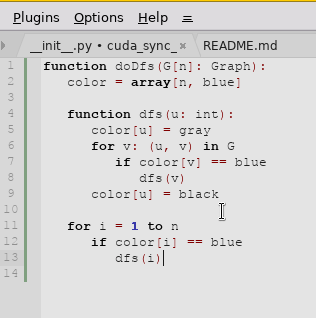

#  CudaText Sync Editing plugin
Sync Editing feature to edit identical identifiers (inspired by [SynWrite](http://uvviewsoft.com/synwrite/))

### Showcase

### Usage
1. Select a block of text (one or multiple lines) containing the identifiers you want to edit.

2. Activation:
   - An icon will appear in the Gutter (left margin) within your selection. If you scroll, it will move to stay visible in the viewport as long as the selection exists.
   - Click this Gutter Icon to enter en Editing mode. Or use the menu: Plugins / Sync Editing / Activate.

3. Editing:
   - The selection highlights are replaced by colored markers.
   - Click on any colored word.
   - Multi-carets will appear on all identical words in that block.
   - Type to rename them all at once.
     Restriction: The UP, DOWN, and ENTER keys are disabled during editing to ensure all multiple cursors stay perfectly synchronized. Use LEFT/RIGHT to navigate within the word.

4. Switch Words (Continuous Editing):
   - To edit a different word in the same block, simply click on it.
   - The previous edit is saved, and the new word becomes active immediately.
   - If you move the caret away from an active word, the plugin returns to "Selection State" (markers remain visible).

5. Finish:
   - Click the Gutter Icon again or press Esc-key to exit the sync-editing completely.
